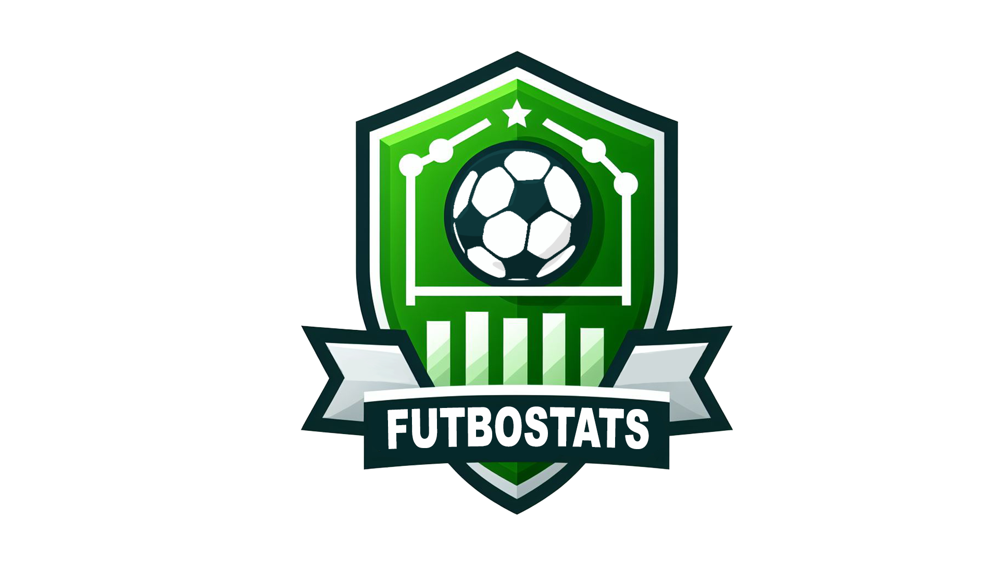

#  ⚽ FutboStats 📊
## ¡Bienvenido a FutboStats! 🚀
FutboStats es una aplicación innovadora que permite a un usuario consultar y analizar estadísticas de una forma sencilla.
Proporciona a los usuarios información detallada sobre equipos, competiciones y partidos en tiempo real además de gráficos, modelos de predicción y una herramienta de tracking.
## 🎯 Características principales
- Visualización de datos en tiempo real: Mantente al día con las estadísticas en vivo de tus equipos y jugadores favoritos.
- Análisis detallado: Obtén informes detallados y gráficos interactivos sobre el rendimiento de equipos y jugadores.
- ImageAI: utiliza la herramienta de tracking ImageAI de una forma sencilla.
- Interfaz intuitiva: Disfruta de una interfaz de usuario moderna y fácil de usar.
- Responsive: utiliza FutboStats en tu ordenador o móvil.

## 🚀 Tecnologías Utilizadas
**Frontend**:
- [**Angular**](https://angular.io/) - Un framework de aplicaciones web robusto y dinámico que proporciona una experiencia de usuario fluida.
  
**Backend**:
- [**Flask**](https://flask.palletsprojects.com/) - Un microframework ligero y flexible para Python, ideal para crear APIs RESTful.

## Web del proyecto:
- [FutboStats](https://futbostats.netlify.app/)

## 📄 Licencia

Este proyecto está bajo la Licencia MIT. Consulta el archivo [LICENSE](./LICENSE.txt) para más detalles.
